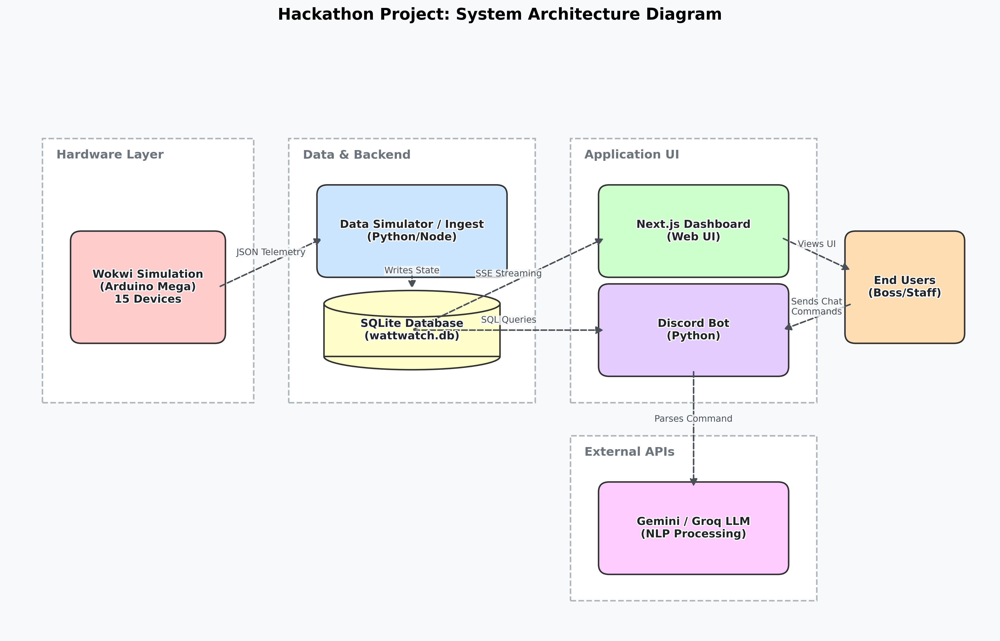

# ⚡ WattWatch: Real-Time IoT Digital Twin & AI-Powered Smart Office Console

> **Winner-Grade Hackathon Entry** // A production-ready, event-driven digital twin designed to monitor, analyze, and optimize office electrical consumption, preventing energy wastage through real-time web consoles and conversational AI Discord integrations.

---

## 🌟 Project Video & Live Demos
*   **Live Web Dashboard**: [https://wattwatch-f099.onrender.com](https://wattwatch-f099.onrender.com)
*   **Vercel Mirror**: [https://watt-watch-chi.vercel.app](https://watt-watch-chi.vercel.app)
*   **Discord Bot Username**: `Smart Circuit Bot` (Active and listening 24/7)

---

## 📝 1. The Problem & Vision
In modern office spaces, electrical appliances (lights, fans, HVACs) are frequently left running overnight or in unoccupied rooms. This leads to:
1.  **Astronomical electricity bills** that go unnoticed until the end of the month.
2.  **Severe environmental carbon footprints** due to unoptimized energy draw.
3.  **Lack of immediate visibility** of live consumption patterns for management.

**WattWatch** bridges this gap. By creating an **Event-Driven Digital Twin** of the office, any team member can see live device states, check current energy consumption (Watts/kWh), receive anomaly alerts, and query office telemetry directly from **Discord** using normal human language.

---

## 🗺️ 2. High-Level Event-Driven Architecture

WattWatch utilizes a single source of truth backed by a local SQLite database, sync'd instantly to clients via an HTTP Server-Sent Events (SSE) stream.



### Data-Flow Walkthrough:
1.  **Simulation/Hardware Layer**: The Python simulator (`simulator.py`) or physical ESP32 chips push telemetry and occupancy logs to Next.js API endpoints.
2.  **API & DB Unification**: API endpoints write state updates (device toggle, occupancy change) directly into `wattwatch.db` (SQLite).
3.  **Real-Time Broadcast**: The database layer triggers an SSE message (`device_update`, `alert`, `usage_update`, `occupancy_update`) over the persistent stream `/api/stream`.
4.  **Subscribers**: The Next.js React Dashboard (Web UI) and the Python Discord Bot receive the update instantly, updating visual panels and sending proactive alerts without page refreshes.

---

## 🚀 3. Core Features

### 🖥️ A. Interactive Web Dashboard Console
*   **2D Office Floorplan Blueprint**: An interactive vector map showing three rooms (Drawing Room, Work Room 1, Work Room 2). Active lights emit a realistic soft glow filter, and active fans feature CSS keyframe spin animations.
*   **Live Device Control**: Toggle all 15 devices (3 rooms, 2 fans and 3 lights per room) with a click. Writes write instantly to SQLite.
*   **Power Consumption Telemetry**: Real-time total power draw (Watts), room-by-room breakdown, and daily accumulated energy consumption (kWh) calculator.
*   **Office Directory Panel**: Renders contact cards of the registered employees pulling directly from SQLite.
*   **Active Alerts Log**: Displays active warnings, allowing users to review and clear anomalies.

### 🤖 B. Conversational AI Discord Bot (`discord_bot.py`)
*   **Persistent Listener**: Connects to the Next.js SSE stream and immediately posts rich warning embeds to a designated channel if devices are left ON in empty rooms.
*   **Gemini 2.5 Flash / Groq LLM Integration**: Uses generative AI to translate raw telemetry values into friendly, professional conversational office reports.
*   **Command Set**:
    *   `!status` -> Returns conversational status of all rooms, active devices, and current occupancy counts.
    *   `!usage` -> Summarizes live active load (W), daily energy used (kWh), and room draw.
    *   `!room <name>` -> Returns live telemetry, occupant list, and active devices for a specific room (e.g. `!room work1`).
    *   `!occupants` -> Lists registered office directory members.

---

## 🔌 4. Hardware ESP32 Circuit Specifications

For a physical deployment, we have designed a representative schematic detailing how each room is monitored.
*   **Actuation**: The ESP32 controls power to the fans/lights via **5-channel Relay Modules** (acting as isolator switches).
*   **Sensing**: **ACS712 Current Sensors** are wired in series with each load to calculate RMS AC Current, translating it to real-time power consumption (Watts).

👉 Review the full hardware guide and circuit diagram: [Hardware Circuit Schematic & Pin Mapping Specification](file:///e:/vs%20code%20projects/WattWatch/WattWatch/circuit_schematic.md).

---

## 👥 5. Mandatory Hackathon Dummy Dataset

The database contains seeded dummy profile directories exposed via the web directory panel and the Discord Bot (`!occupants`):

| Name | Role | Email | Phone Number |
| :--- | :--- | :--- | :--- |
| **Nafisa Rahman** | Lead Developer | `nafisa.rahman@yahoo.com` | `+8801812345678` |
| **Tanvir Hossain**| System Admin | `tanvir.hossain@yahoo.com` | `+8801912345678` |

---

## ⚙️ 6. Quick Setup & Run Instructions

### Step 1: Clone and Install Dependencies
```bash
# Clone the repository
git clone https://github.com/Saobia3i/WattWatch.git
cd WattWatch

# Install Dashboard dependencies
npm install

# Install Python Bot & Simulator dependencies
pip install -r requirements.txt
```

### Step 2: Configure Environment Variables (`.env`)
Create a `.env` file in the root folder (or copy `.env.example`):
```env
# Next.js Server Configurations
NEXT_PUBLIC_API_URL=https://wattwatch-f099.onrender.com

# Discord Bot Configurations
DISCORD_BOT_TOKEN=your_discord_bot_token_here
DISCORD_ALERT_CHANNEL_ID=1430850944249233468

# Generative AI Key (Optional)
GEMINI_API_KEY=your_gemini_api_key_here
```

### Step 3: Run the Web Dashboard
```bash
# Start Next.js development server
npm run dev
```

### Step 4: Run the Python Simulator (Local Telemetry Feed)
```bash
python simulator.py
```

### Step 5: Run the Discord Bot
```bash
python discord_bot.py
```

---
## 🔌 Hardware Simulation (Wokwi)

To simulate our office environment without physical hardware, we used [Wokwi](https://wokwi.com/) to build a virtual Arduino Mega setup. This simulates our 15 devices (fans and lights across 3 rooms), PIR motion sensors, and physical wall switches. 

### Wokwi Setup Instructions

1. Go to [Wokwi Arduino Simulator](https://wokwi.com/arduino/projects) and open a new Arduino Mega project.
2. Open the `arduino/` folder in this repository.
3. Copy the contents of `sketch.ino` into the Wokwi code editor.
4. Copy the contents of `diagram.json` into the Wokwi diagram editor (this will automatically generate the wiring, sensors, and switches).
5. Click the green **Play** button to start the simulation.

### How to Test and Verify Output

Once the simulation is running, you can manually interact with the virtual environment to test the logic:

* **Triggering Sensors:** Click on any of the PIR sensors and press "Simulate Motion" to mimic an employee walking into a room. 
* **Toggling Devices:** Click the physical slide switches to manually turn individual fans and lights ON or OFF.
* **Checking the Telemetry:** Open the **Serial Monitor** at the bottom of the Wokwi screen. 

You should immediately see live JSON strings printing every second, representing the current state of the office. It will look like this:

`{"room":"drawing","occupants":1,"fan1":0,"fan2":1,"light1":1,"light2":0,"light3":0}`

This JSON telemetry is what our Python/Node backend ingests to update the `wattwatch.db` database in real-time!

---

### How the Hardware Logic Works

Our simulated Arduino Mega acts as the physical brain of the office, processing inputs and broadcasting state changes:

* **Occupancy Tracking:** We use PIR motion sensors mapped to entryways. The logic increments or decrements a `peopleCount` variable to track exactly how many employees are in a given room at any time.
* **Manual Override Control:** To prevent wasteful energy consumption (and to reflect real-world behavior), the devices do not turn on automatically when someone enters. Instead, the 15 devices (2 fans and 3 lights per room) strictly read the physical state of the manual slide switches. 
* **JSON Telemetry Generation:** Every second, the Arduino's main loop reads the current switch states and sensor counts, packages them into a formatted JSON string, and pushes them out via the Serial Monitor. This acts as the raw data pipeline for our backend.

---

## 🤖 7. Discord Bot Command Cheat Sheet

| Command | Action | Sample AI-Generated Output |
| :--- | :--- | :--- |
| `!status` | Checks status of all rooms | *"Good afternoon team! Currently, the Work Room 1 has 1 light active (1 occupant), the Drawing Room has all devices off, and Work Room 2 is active with 1 fan running. The office is looking efficient!"* |
| `!usage` | Returns current power draw | *"System Check: We are pulling a total of **220 Watts** right now. Today's total energy used is **4.872 kWh**. Work Room 2 is drawing the most power (120W) due to the ceiling fan."* |
| `!room work1`| Retrieves specific room stats | *"Work Room 1: Currently occupied by 1 person. Fan 1 is OFF, Light 1 is ON. No energy wastage warnings."* |
| `!occupants`| Shows employee contact list | *"Here is the current registered office list: Nafisa Rahman (Lead Developer) & Tanvir Hossain (System Admin)."* |

---

## 🔒 8. Anomaly & Safety Rules
The system checks and issues alerts automatically for the following anomaly triggers:
1.  **After-Hours Activity**: Any lights/fans left running outside 9 AM - 5 PM business hours.
2.  **Unoccupied Room Waste**: Lights/fans running in a room where the sensor reads `is_occupied = 0` for more than 15 minutes.
3.  **Continuous Run Warning**: Any device running continuously for more than 2 hours without interruption.
